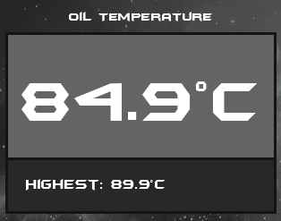
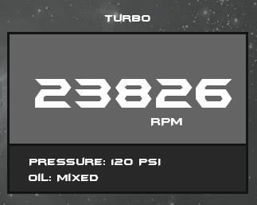
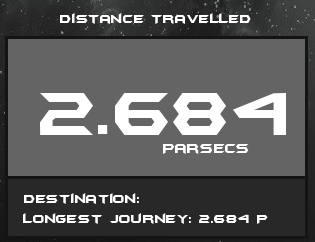
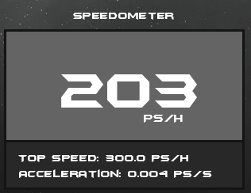
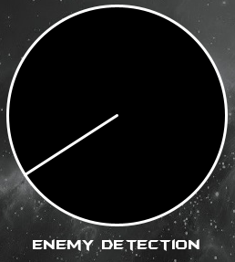

# SciFi UI Project

Name: Ben Cosgrave

Student Number: C17445274

# Description of the assignment
This assignment tasked me with creating a futuristic / SciFi user interface using Java and Processing. A lot of thought went into what sort of design I wanted do go with, and in the end I settled on something similar to what's found in the Iron Man video games. The UI found throughout that game is simplistic yet also interesting. It has a perfect balance of complexity and aesthetics, which is why I chose to base my design around it.

# Instructions
Once the program begins, not much of the UI is visible. The local time, power status bar and the left panel is all that shows until a button is clicked from the left panel.

1 - Click on the Engine Information button.
   This will display several more screens: Oil Temperature, Turbo, Distance Travelled and Speedometer. These screens update by themselves using the update() function which is called 60 times per second. At the bottom of the screen now shown is a Fuel tank, which depletes slowly as the ship travels further. Once the fuel tank is emptied, it is refilled automatically.
   
2 - Click on the Weapons Information button.
   This presents several displays: Weapons Systems & Status, Current & Total Ammo, and an Enemy Detection Radar. Weapons are displayed with a green background if they are currently active and usable, and red if inactive and unusable.
   
3 - Click the Weather Information button.
   The screen will now display a grid of the current galaxy sector which the ship is flying in. The number below each circle corresponds to the danger level of that weather condition and the size of the circle surrounding them represents the area of space in which it effects.
   
4 - Click the System Information button.
   This screen shows a graphic of the ship's specifications and some information about it's origin and serial number.

# How it works
The time is updated using the text() and hour(), minute() and second() functions, which pulls the current system time from the computer which the program is running on. I placed them into variables which are updated every time the update() function runs - 60 times per second.
```Java
int s = second();
int m = minute();
int h = hour();

public void update()
{
    s = second();
    m = minute();
    h = hour();
}
```

The Power Bar which is diplayed at the top of the screen is a composition of two rectangles. One of which is a lot smaller and moves horizontally until it reaches the X-coordinate and Width value of the other. The speed may be set when declaring an instance of the object, in this case it is set at a speed of 4 pixels every 1/60th of a second.
```Java
public PowerBar(UI ui, float x, float y, float width, float height, int speed)
{
    this.ui = ui;
    this.x = x;
    this.y = y;
    this.width = width;
    this.height = height;
    this.speed = speed;
}

pbar = new PowerBar(this, 570, 40, 570, 40, 4);

public void update()
{
    // If travelling bar reaches right edge of power bar
    if(offset >= width - (width / 10))
    {
        direction = -1;
    }
    // If travelling bar reaches left edge of power bar
    if(offset <= 0)
    {
        direction = 1;
    }
    offset += direction * speed;
}
```

- The Engine Button utilises 4 subclasses of the Monitor class; EngineOil, EngineTurbo, EngineDistance and EngineSpeed. Each comprises of a rectangular shape with room for large text and smaller text.

Oil Temperature



```Java
public void update()
{
    if (i % 60 == 0)
    {
        Random r = new Random();
        random = min + r.nextFloat() * (max - min);
        temperature = random;
        i = 0;
    }
    i++;

    if(temperature > maxTemp)
    {
        maxTemp = temperature;
    }
}
```

Turbo Boost



```Java
public void update()
{
    if (i % 60 == 0)
    {
        Random r = new Random();
        random = (int) (min + r.nextFloat() * (max - min));
        rpm = random;
        i = 0;
    }
    i++;
}
```

Distance



```Java
public void update()
{
    distance += 0.0001f;
    if(distance > maxDist)
    {
        maxDist = distance;
    }
}
```

Speedometer



```Java
public void update()
{
    if (i % 120 == 0)
    {
        Random r = new Random();
        random = (int) (min + r.nextFloat() * (max - min));
        speed = random;
        i = 0;
    }
    i++;
}
```

```Java
public EngineOil(UI ui, float x, float y, float min, float max, String text)
{
    this.ui = ui;
    this.x = x;
    this.y = y;
    this.min = min;
    this.max = max;
    this.text = text;
}

Also included in this screen is a Fuel Tank, which operates by incrementing and subtracting a counter from the width of the bar until it reaches 0. Code as shown below:
```Java
public void render()
{
    ui.noFill();
    ui.stroke(255);
    ui.strokeWeight(3);
    ui.rect(x, y, width, height);

    ui.noStroke();
    ui.fill(204,204,0);
    ui.rect(x + 1, y + 1, (width - 1) - counter, height - 1);

    ui.fill(255);
    ui.textSize(40);
    ui.text(text, x + width / 2, y + height / 2);        
}

public void update()
{
    if (counter < (width - 1))
    {
        counter += 0.02f;
    }
    else
    {
        counter = 0f;
    }
}
```

- The Weapons Information screen uses a for-loop to draw 5 bars representing each weapon system. Similar to how the Fuel tank worked on the Engine screen, a counter is incremented until it reaches the height of the bar and then is set back to 0, thus giving a pulsing effect representing that the system is connected to the ship. Two classes used on this screen are subclasses of Monitor; WeaponAmmo and WeaponSystem. A radar is also implemented by updating the destination co-ordinates of the line() function by changing the value of Theta. 


The following code is what was used to draw the 5 weapon systems bars.
```Java
for(int i = 0; i < 5; i++)
{
    ui.stroke(0);
    ui.noFill();
    ui.rect(x - 1 + (i*120), y - 1, 101, 301);
    if (status[i] == "Active")
    {
        // Green
        ui.fill(60,179,113);
    }
    else
    {
        // Red
        ui.fill(139,0,0);
    }
    ui.rect(x + (i*120), y, 100, counter);
    ui.fill(255);
    ui.textSize(14);
    ui.text(status[i], x + 50 + (i * 120), y + 150);
    ui.textSize(10);
    ui.fill(255);
    ui.text(weapons[i], x + 50 + (i * 120), y + 320);
}
```



x2, y2, the co-ordinates of the second point used as parameters of the line() function and the update() function which sets the value of theta:
```Java
float x2 = pos.x + (float) Math.sin(theta) * radius;
float y2 = pos.y - (float) Math.cos(theta) * radius;

public void update()
{
    theta += PApplet.TWO_PI * timeDelta * frequency;
}
```

# What I am most proud of in the assignment

# Markdown Tutorial

This is *emphasis*

This is a bulleted list

- Item
- Item

This is a numbered list

1. Item
1. Item

This is a [hyperlink](http://bryanduggan.org)

# Headings
## Headings
#### Headings
##### Headings

This is code:

```Java
public void render()
{
	ui.noFill();
	ui.stroke(255);
	ui.rect(x, y, width, height);
	ui.textAlign(PApplet.CENTER, PApplet.CENTER);
	ui.text(text, x + width * 0.5f, y + height * 0.5f);
}
```

So is this without specifying the language:

```
public void render()
{
	ui.noFill();
	ui.stroke(255);
	ui.rect(x, y, width, height);
	ui.textAlign(PApplet.CENTER, PApplet.CENTER);
	ui.text(text, x + width * 0.5f, y + height * 0.5f);
}
```

This is an image using a relative URL:


This is an image using an absolute URL:


This is a youtube video:

[](https://www.youtube.com/watch?v=J2kHSSFA4NU)

This is a table:

| Heading 1 | Heading 2 |
|-----------|-----------|
|Some stuff | Some more stuff in this column |
|Some stuff | Some more stuff in this column |
|Some stuff | Some more stuff in this column |
|Some stuff | Some more stuff in this column |

